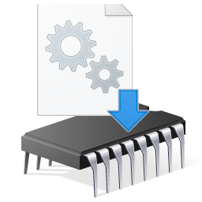

# StealthModule.NET :: Load modules in-memory and invoke

    

This project is heavily based on [DllFromMemory.Net](https://github.com/schellingb/DLLFromMemory-net/) and [DInvoke](https://github.com/TheWover/DInvoke) project.

Some enhancements are applied:

1. Extra indirection layer is added when calling native APIs. (No single P/Invoke usages)

2. No `nameof()` usages. All strings and type names are able to be obfuscated.

## Exemplary usages

* Load DLLs in-memory without leaving the file artifacts to the disk.

    * Instead of manually extracting the native DLL to the disk and then invoking them, load them directly from byte array or resource and use!

    * Manual map core Win32 libraries to bypass API hooking and evade AV/EDR.

* Use native methods in C# without any P/Invokes. (No more P/Invoke to `GetProcAddress`)

    * Make your program easy-to-obfuscate while using native method calls. (String Encryption and Resource Encryption will make your protection stronger)

## How to use

### [MemoryModule](StealthModule/MemoryModule.md)

### [ExportResolver](StealthModule/ExportResolver.md)

## How to reference this project from your project

### Solution 1 - git submodule (recommended)

1. Add this project to your repository using command: `git submodule add https://github.com/hsheric0210/StealthModule.NET`

2. Add the project file `StealthModule.csproj` to your project.

3. Add the reference to StealthModule to your own project. (Project > Add Reference > Projects; `Alt+P R` > Projects)

### Solution 2 - Manual DLL reference

1. Build this project to obtain StealthModule.dll (you must build in both 32-bit, 64-bit version)

2. Add reference to each 32-bit and 64-bit StealthModule.dll

## Contributions

DllFromMemory.Safer.NET is based on DllFromMemory.Net commit 7b1773c8035429e6fb1ab4b8fd0a52d2a4810efc.
https://github.com/schellingb/DLLFromMemory-net

DLLFromMemory.Net is based on Memory Module.net 0.2
Copyright (C) 2012 - 2018 by Andreas Kanzler
https://github.com/Scavanger/MemoryModule.net

Memory Module.net is based on Memory DLL loading code Version 0.0.4
Copyright (C) 2004 - 2015 by Joachim Bauch
https://github.com/fancycode/MemoryModule

## Related repositories

* [DllFromMemory.Net](https://github.com/schellingb/DLLFromMemory-net)
* [DInvoke](https://github.com/TheWover/DInvoke)

`Resolver.cs` is based on DInvoke [Generic.cs](https://github.com/TheWover/DInvoke/blob/15924897d9992ae90ec43aaf3b74915df3e4518b/DInvoke/DInvoke/DynamicInvoke/Generic.cs)

DLL Manual Mapping utility parts are based on DLLFromMemory-net [DLLFromMemory.cs](https://github.com/schellingb/DLLFromMemory-net/blob/7b1773c8035429e6fb1ab4b8fd0a52d2a4810efc/DLLFromMemory.cs#)
